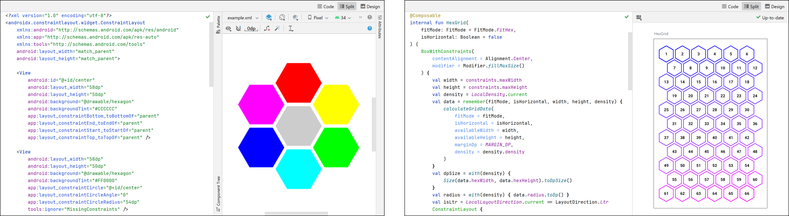
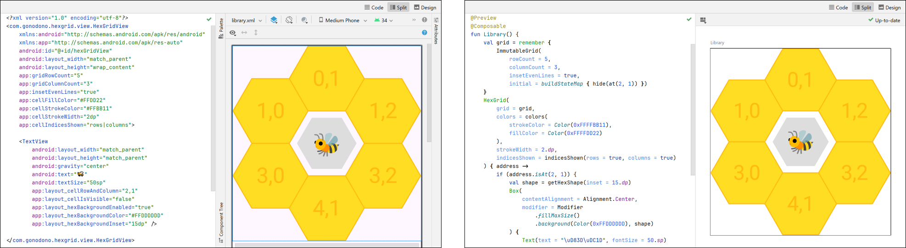

# Hex Grids for Android

Implementations of UI layouts and controls arranged as hex grids, also called
hexagonal grids, hex maps, beehive layouts, honeycombs, etc.

+ [**Examples**](#examples)

  A couple of different ways to assemble hex grids using `ConstraintLayout` in
  both Views and Compose.

+ [**Library**](#library)

  A complete library with custom components in both frameworks, usable as
  layouts and/or controls.

<br />


## Examples

+ [Code][examples]
+ [Wiki][examples-wiki]

<br />


The `ConstraintLayout` examples are currently hosted in their own launcher
`Activity` in the `demo` app, simply to avoid having to mess with multiple apps.
There are examples in each framework for two different designs: Shield and Grid.

<p align="center">

</p>

+ The Shield examples show a simple design of seven cells with one in the center
  circled by the others. The View version is initialized from a layout resource
  in order to illustrate how such an arrangement can be specified in XML. Both
  versions have runtime routines that size the content to fit the container's
  width, and that rearrange the children upon changing the hex orientation.

+ The Grid examples demonstrate how to generate grids dynamically, taking into
  consideration the available space and either the desired number of
  rows/columns, or a specific hexagon size.

Using existing components and APIs certainly has its advantages; e.g.,
familiarity, reduced overhead, etc. However, this approach does have its
downsides, too. For example, all of the hexagon components are actually still
rectangular in shape, as far as the frameworks are concerned, so touch handling
doesn't really work correctly in the corner areas that lie outside of the
hexagonal bounds.

Also, you might have a hard time getting things lined up exactly, since we're
basically relaying data through intermediate painters using `LayoutParams` and
`Dp` values, while trying to get them to draw to the `Canvas` with pixel-level
precision. This probably isn't an issue for most layouts, but it could be a
problem for other uses, like image editors or game grids.

If you need that precision, or accurate touch feedback, or any of the other
conveniences and amenities that come with dedicated components, you might give
the library a try.

<br />


## Library

+ [Views](#views)
+ [Compose](#compose)
+ [Notes](#notes)
+ [Download](#download)
+ [Documentation][documentation]
+ [Wiki][wiki]

<br />


> [!IMPORTANT]
> The information presented here, in the documentation, and in the wiki is
> accurate for [Release 0.1.3][current-release] only. The library is in the
> middle of a minor overhaul without any deprecation stage, so some things are
> incompatible between that release and the current code.

<br />


These components were designed to offer maximum flexibility in defining a grid's
shape and draw settings while maintaining precise placement and touch
resolution. They're still limited in many areas, but their current feature set
should be sufficient to produce about any shape or arrangement you might need,
though other design aspects may take a bit of patching, for the time being.

The `HexGridView` class and the `HexGrid` Composable share common core modules,
so they both have all of the same features that are configurable through
properties and parameters that are quite similar.

<p align="center">

</p>
<p align="center">
<sup><em>On the left is <code>library.xml</code>. On the right, the
<code>Library</code> Composable.</em></sup>
</p>


### Views

<details>
  <summary><code>res/layout/library.xml</code></summary>

```xml
<?xml version="1.0" encoding="utf-8"?>
<com.gonodono.hexgrid.view.HexGridView
    xmlns:android="http://schemas.android.com/apk/res/android"
    xmlns:app="http://schemas.android.com/apk/res-auto"
    xmlns:tools="http://schemas.android.com/tools"
    android:id="@+id/hexGridView"
    android:layout_width="match_parent"
    android:layout_height="wrap_content"
    app:gridRowCount="5"
    app:gridColumnCount="3"
    app:insetEvenLines="true"
    app:cellFillColor="#FFDD22"
    app:cellStrokeColor="#FFBB11"
    app:cellStrokeWidth="2dp"
    app:cellIndicesShown="rows|columns">

    <TextView
        android:layout_width="match_parent"
        android:layout_height="match_parent"
        android:gravity="center"
        android:text="🐝"
        android:textSize="50sp"
        app:layout_cellRowAndColumn="2,1"
        app:layout_cellIsVisible="false"
        app:layout_hexBackgroundColor="#FFDDDDDD"
        app:layout_hexBackgroundInset="15dp"
        tools:ignore="HardcodedText,TextContrastCheck" />

</com.gonodono.hexgrid.view.HexGridView>
```
</details>

`HexGridView` is a `ViewGroup`, and it allows children to be added in the
layout. It has several local and child attributes available to allow
initializing as much as possible from the XML. A shaped background can be
applied through these attributes too, directing the View to set a
specialized Drawable as the child's background upon addition to the group.

It's also possible to configure `HexGridView` entirely programmatically, or
through any combination of XML and code. Populating children in this context is
done with the `ViewProvider` interface that works very much like `Adapter`s do
for `ListView`s and `RecyclerView`s, though there's no recycling happening. If
one were to move the `<TextView>` child in the `library.xml` layout to its own
file, it could be added from code like so:

```kotlin
hexGridView.viewProvider = HexGridView.ViewProvider { address, current ->
    when {
        address.isAt(2, 1) -> current
            ?: layoutInflater.inflate(R.layout.bee, hexGridView, false)

        else -> null
    }
}
```

The `view` package also contains `HexGridDrawable` in order to allow these grids
to be displayed wherever Drawables can be used. It lacks several of the main
components' features – like wrapping to the content and hosting children – but
it uses the same core data and draw modules, so it will otherwise look and
behave identically.

<br />


### Compose

<details>
  <summary><code>@Composable Library</code></summary>

```kotlin
import androidx.compose.foundation.background
import androidx.compose.foundation.layout.Box
import androidx.compose.foundation.layout.fillMaxSize
import androidx.compose.material3.Text
import androidx.compose.runtime.Composable
import androidx.compose.runtime.remember
import androidx.compose.ui.Alignment
import androidx.compose.ui.Modifier
import androidx.compose.ui.graphics.Color
import androidx.compose.ui.tooling.preview.Preview
import androidx.compose.ui.unit.dp
import androidx.compose.ui.unit.sp
import com.gonodono.hexgrid.compose.HexGrid
import com.gonodono.hexgrid.compose.HexGridDefaults.colors
import com.gonodono.hexgrid.compose.HexGridDefaults.indicesShown
import com.gonodono.hexgrid.compose.ImmutableGrid
import com.gonodono.hexgrid.data.buildStateMap
import com.gonodono.hexgrid.data.isAt

@Preview
@Composable
fun Library() {
    val grid = remember {
        ImmutableGrid(
            rowCount = 5,
            columnCount = 3,
            insetEvenLines = true,
            initial = buildStateMap { hide(at(2, 1)) }
        )
    }
    HexGrid(
        grid = grid,
        colors = colors(
            strokeColor = Color(0xFFFFBB11),
            fillColor = Color(0xFFFFDD22)
        ),
        strokeWidth = 2.dp,
        indicesShown = indicesShown(rows = true, columns = true)
    ) { address ->
        if (address.isAt(2, 1)) {
            val shape = getHexShape(inset = 15.dp)
            Box(
                contentAlignment = Alignment.Center,
                modifier = Modifier
                    .fillMaxSize()
                    .background(Color(0xFFDDDDDD), shape)
            ) {
                Text(text = "\uD83D\uDC1D", fontSize = 50.sp)
            }
        }
    }
}
```
</details>

The library's Composable version is named `HexGrid`, and it has basically all of
the same features and functionalities as the `View` version. Since it has to be
done in code, we have to define the grid's shape and states using the library's
custom collection type, `Grid`. The Compose implementation is `ImmutableGrid`,
which is really just a wrapper around View's `MutableGrid` that hides the
mutators.

A custom collection is used here because of the unusual grid address system,
which is actually not unique to this library, but which I can't really expect
users to keep track of on their own, especially since the valid row/column pairs
change depending on which lines are inset. Further information on `Grid` and its
properties can be found on [its wiki page][grid-wiki]

Lastly here, the `getHexShape()` function shown in the `border()` modifier in
the snippet above is how children are given hexagonal shapes in Compose. Its
functionality is similar to that of View's custom background Drawable, but since
it's a `Shape`, it can effect several more draw modes than the Drawable
currently supports. It's up to the user to apply the `Shape` wherever is
appropriate.

<br />


### Notes

#### Demo app

The `demo` module contains a small, simple app that demonstrates most everything
in the library.

<p align="center">

</p>

It was designed and tested on only a few large phone screens, so it might not
look that great on other formats. Just a heads up.


#### The library's future

The custom components are currently in the process of evolving from casual
examples that were published just for convenience, to an actual maintained
library-type dealy, so many things are going to change, some pretty drastically.
Because of that, this recent revision and release are mostly just small patches
to keep this version working in the interim, in case the update takes too long.
Some details in the docs and wiki might become stale or inaccurate until the
next release.

<br />


### Download

I've configured the library to be published, so you can get a compiled version
through [JitPack][jitpack]. The repo's page is [here][jitpack-hex-grid], and it
has instructions toward the bottom on how to add JitPack and the library's
dependency to your project.

<br />


## License

MIT License

Copyright (c) 2024 Mike M.

Permission is hereby granted, free of charge, to any person obtaining a copy
of this software and associated documentation files (the "Software"), to deal
in the Software without restriction, including without limitation the rights
to use, copy, modify, merge, publish, distribute, sublicense, and/or sell
copies of the Software, and to permit persons to whom the Software is
furnished to do so, subject to the following conditions:

The above copyright notice and this permission notice shall be included in all
copies or substantial portions of the Software.

THE SOFTWARE IS PROVIDED "AS IS", WITHOUT WARRANTY OF ANY KIND, EXPRESS OR
IMPLIED, INCLUDING BUT NOT LIMITED TO THE WARRANTIES OF MERCHANTABILITY,
FITNESS FOR A PARTICULAR PURPOSE AND NONINFRINGEMENT. IN NO EVENT SHALL THE
AUTHORS OR COPYRIGHT HOLDERS BE LIABLE FOR ANY CLAIM, DAMAGES OR OTHER
LIABILITY, WHETHER IN AN ACTION OF CONTRACT, TORT OR OTHERWISE, ARISING FROM,
OUT OF OR IN CONNECTION WITH THE SOFTWARE OR THE USE OR OTHER DEALINGS IN THE
SOFTWARE.


  [examples]: https://github.com/gonodono/hex-grid/tree/main/demo/src/main/kotlin/com/gonodono/hexgrid/demo/examples

  [examples-wiki]: https://github.com/gonodono/hex-grid/wiki/Intro

  [documentation]: https://gonodono.github.io/hex-grid

  [wiki]: https://github.com/gonodono/hex-grid/wiki

  [current-release]: https://github.com/gonodono/hex-grid/releases/tag/0.1.3

  [grid-wiki]: https://github.com/gonodono/hex-grid/wiki/Grid-definitions

  [jitpack]: https://jitpack.io

  [jitpack-hex-grid]: https://jitpack.io/#gonodono/hex-grid