# Hex Grid for Android

A basic hex grid component for Views and Compose that can be used as a layout, a
clickable/selectable grid control, or a combination of the two.

## Contents

+ [Conventions and terminology](#conventions-and-terminology)
+ [Grid definitions](#grid-definitions)
+ [Layout definitions](#layout-definitions)
+ [Views](#views)
+ [Compose](#compose)
+ [General notes](#general-notes)
+ [Download](#download)
+ [Documentation](https://gonodono.github.io/hex-grid)

## Conventions and terminology

+ Everything in the library is row-major. Grid coordinates are always
  in (`row`,`column`) order, and grid sizes are always `rowCount`x`columnCount`.

+ "UI component", "component", and similar phrases are used as general terms for
  individual `View`s and `Composable`s.

+ "Lines" is used as the umbrella term for rows and columns. Many options and
  calculations are the same for both, due to the inherent symmetries of
  staggered grids; e.g., insetting even rows is the same as insetting even
  columns, hence `insetEvenLines`.

+ "Cross" is used to refer to the other, perpendicular set of lines. For
  example, if the current bit of code is handling rows, columns are the cross
  lines.

+ "Stroke" is used for the hexagon outline; i.e., those lines drawn
  by `Canvas#drawLine()`.

## Grid definitions

Though it's intuitive to define rows and columns as contiguous cells, that would
mean that, depending on the hexagon's orientation, one type would end up a
little wonky:

<p align="center">
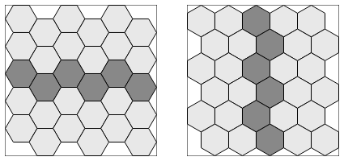
</p>

This would make it almost impossible to create certain shapes, including some
basic ones like:

<p align="center">
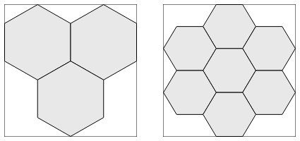
</p>

To ensure that it is possible to make any particular setup with sensible
options, this library defines rows and columns as collinear cells. That is, each
row and column comprises only the cells that are centered directly on its line,
which gives rise to an unusual grid coordinate system.

<p align="center">
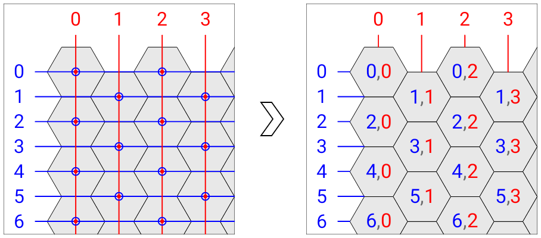
</p>

Because of this design, the valid coordinate pairs depend on whether the even or
the odd lines are inset. When it's the evens, the grid above changes to:

<p align="center">
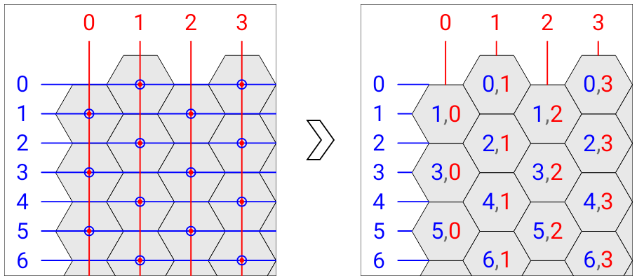
</p>

This might seem like a huge pain to keep track of, but one of the library's main
features is the option to display the row and column in each cell during design
and debugging, so it's trivial to get everything in the right spot when using it
as a layout:

<p align="center">
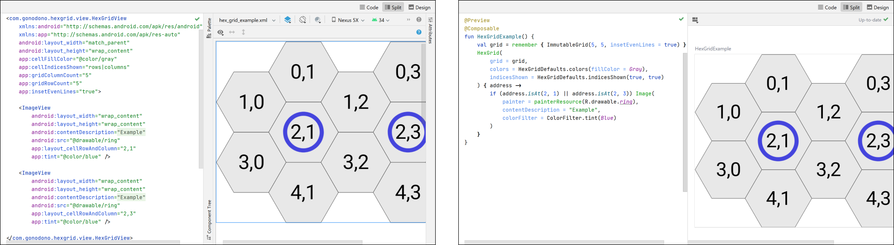
</p>

If you're using it as some sort of game grid, then you're already doing math
anyway, and one more index offset or parity check here and there isn't a big
deal.

The row count, the column count, and which lines to inset are three of the four
configuration options that define a `Grid`, which is the specialized collection
for these objects.

```kotlin
interface Grid {
    val rowCount: Int
    val columnCount: Int
    val insetEvenLines: Boolean
    val enableEdgeLines: Boolean
    …
}
```

The fourth option, `enableEdgeLines`, is discussed after the layout options,
since a few items covered there are relevant to the edge lines' use and
behavior.

The library defines the `Grid.Address` class to keep a pair of row and column
indices together.

```kotlin
data class Address(val row: Int, val column: Int)
```

`Grid` itself is indexed by `Grid.Address` to access its `Grid.State` objects.

```kotlin
data class State(val isVisible: Boolean, val isSelected: Boolean)
```

If you need to read the `Grid` at runtime, it acts somewhat like
a `Map<Grid.Address, Grid.State>`: it has a `forEach()` function for iteration
and a `get` indexed accessor.

```kotlin
var firstSelected: Grid.Address? = null
grid.forEach { address, state ->
    if (state.isSelected) {
        firstSelected = address
        return@forEach
    }
}
…
val currentState = grid[firstSelected!!]
```

## Layout definitions

### FitMode

The library bases its measurements and layouts on regular hexagons, and like any
regular polygon, the size in one Cartesian dimension determines the size in the
other. To specify which dimension defines the hexagon's size, the library offers
the `FitMode` enum to choose whether it's calculated from the available width
and the number of columns, or the available height and the number of rows;
i.e., `FitColumns` or `FitRows`.

A hex grid in either framework must fit a bounded dimension. Due to Android's
affinity for portrait, the default value is `FitColumns`, and the width must
have a fixed or maximum value in that mode. In `FitRows` mode, the height must
have a fixed or maximum value.

### CrossMode

The `CrossMode` enum specifies how to layout the cross lines if the component
has a fixed size in that direction: either aligned to the start, center, or end,
or scaled to fit. If the component does not have a fixed measure in the cross
direction, it will wrap to the grid's size.

The examples below are all `FitColumns`, so the `CrossMode` is being applied in
the vertical direction, along the rows.

<p align="center">
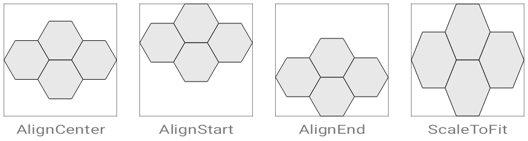
</p>

The `ScaleToFit` option will cause the hexagons to be stretched or shrunk
irregularly in most cases, but it's hardly noticeable at small scales, so it's
handy to fill out grids that only need a tiny adjustment, or if regular hexagons
aren't a strict requirement anyway.

### HexOrientation

The next layout option is the custom enum `HexOrientation`, with
values `Horizontal` and `Vertical`, and it simply determines in which direction
a major axis is aligned.

<p align="center">

</p>

### Stroke width

The last setting which affects the grid's layout is the stroke width of the line
that draws the hexagons. As the stroke width increases, the actual grid outline
is inset to keep everything within the component's bounds, as illustrated in the
first image here:

<p align="center">
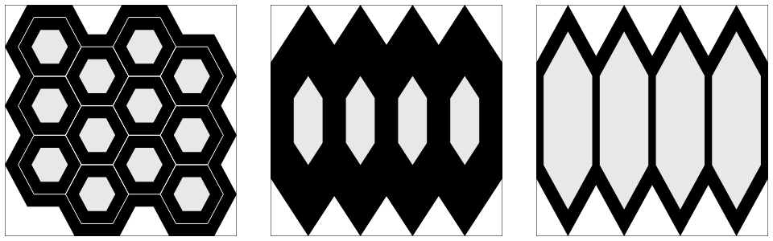
</p>

As you can see in the second and third images, large-ish stroke width and scale
values can cause noticeable visual discrepancies in the resultant width of the
angled lines compared to the straight ones, because it scales the draw as a
whole. The difference between the two is due to the middle one
being `FitColumns` and scaling the rows to fit, and the last one being `FitRows`
and scaling the columns. This could be remedied, if necessary, but you'd have to
rework the core method used to draw the individual hexagons.

It is important to note that, no matter the stroke width, the current
implementation resolves cell hits with respect to an infinitesimal outline. That
is, the stroke width doesn't shrink a cell's hit area at all.

### That last Grid definition: Edge lines

In all of the example images so far, the grids have fit completely inside the
containing component's bounds, which causes partial "holes" on the sides where
the grid touches the component's edge. For those setups that need those holes
filled, the `enableEdgeLines` option is available to add another line of cells
on each edge.

The example below is one of the simple setups shown under **Grid definitions**
with edge lines enabled. The left image shows how it would look in normal use,
with the extra edge cells highlighted here for illustration. The right image
shows the unclipped draw with indices enabled, so you can see what's actually
happening.

<p align="center">
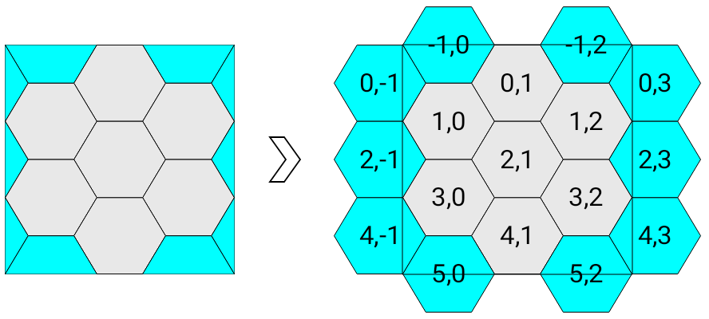
</p>

This feature is meant to be used only with grids that fully fill the containing
component, since grids that don't fill can always have more lines added in the
regular fashion. However, nothing prohibits or prevents this option from being
employed in any other setup.

Unfortunately, relatively thick stroke widths can cause a visual problem with
edge lines, too, due to the library calculating the grid's layout so that the
main rows and columns fit exactly to bounds, even accounting for the different
line thickness at the two main axis vertices – the pointy ends – compared to the
others.

<p align="center">
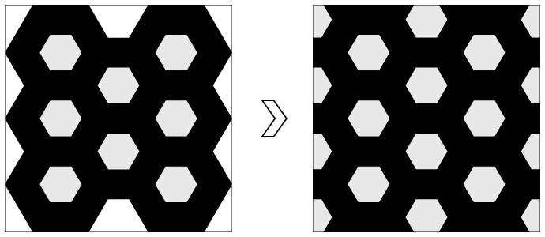
</p>

Those are the same grid, but the one on the right has edge lines enabled, and
you can see how the out-of-bounds cells are inset by a noticeable measure. This
could be remedied by adding an option to halve the stroke width consideration
when edge lines are enabled.

## Views

`HexGridView` is the `View` version of the library's grid UI. It's actually
a `ViewGroup`, and is designed to allow adding children either in layout XML, or
in code through a specialized interface.

### XML setup

`HexGridView` can be set up completely through its layout XML, and it recognizes
several special attributes on itself and its children in order to allow for
that. All attributes in the snippet below belong to the library, and are shown
with their default values. I'm not a big fan of projects that slap a common
prefix and underscore on every custom attribute, so I've avoided that here, but
several of them do share somewhat descriptive prefixes that have been added in
an attempt to avoid name collisions with the platform and other standard
libraries.

```xml
<com.gonodono.hexgrid.view.HexGridView
    …
    app:gridRowCount="0"
    app:gridColumnCount="0"
    app:insetEvenLines="false"
    app:enableEdgeLines="false"
    app:fitMode="fitColumns"
    app:crossMode="alignCenter"
    app:hexOrientation="horizontal"
    app:cellStrokeWidth="0dp"
    app:cellStrokeColor="@color/black"
    app:cellFillColor="@color/transparent"
    app:cellSelectColor="@color/light_gray"
    app:cellIndicesShown="none">

    <com.gonodono.hexgrid.view.CellStateView
        …
        app:layout_cellRowAndColumn="0,0"
        app:layout_cellIsVisible="true"
        app:layout_cellIsSelected="false"
        app:layout_hexBackgroundEnabled="false"
        app:layout_hexBackgroundColor="@color/transparent"
        app:layout_hexBackgroundInset="0dp" />

  </com.gonodono.hexgrid.view.HexGridView>
```

The attributes on the `<HexGridView>` should be rather self-explanatory, given
the information already provided. The `layout_` attributes on the child are in
two groups: those that start with `cell` that denote and affect the relevant
grid cell, and those that start with `hexBackground`, which allow for
a `HexDrawable` to be set as the child's background.

`HexDrawable` is a simple class that sets a hexagonal `Outline` – which allows
it to cast appropriately shaped shadows – and fills it with a solid color. The
class is `open` to permit further customizations; e.g., using a `Shader` instead
of a solid color, inserting a `RippleDrawable`, etc.

Any kind of normal child `View` can be used with `HexGridView`. The library also
offers the custom `CellStateView`, which can be used to apply `cell` attributes
to the grid without adding an actual `View` instance at runtime. Since no child
is added, the `hexBackground` attributes are useless on a `<CellStateView>`. The
XML above is just for show.

### Code setup

Setup in code is a little different than you might expect from the available
attributes. As previously mentioned, the row count, the column count, which
lines to inset, and whether to enable edge lines are the four things that define
a `Grid`, and `HexGridView` handles those things altogether through its
single `var grid: Grid` property, since changing any of them defines a new grid
anyway.

The `View` version's implementation of `Grid` is `MutableGrid`, which allows (
only) the `Grid.State`s to be changed for each of the predefined `Grid.Address`
es. (`Mutable` probably isn't the most appropriate descriptor for this,
but `Changeable` or something similar would be unwieldy and confusing.) To
effect this functionality, `MutableGrid` has an additional `set` indexed
accessor.

```kotlin
val mutableGrid = MutableGrid(3, 3, insetEvenLines = true)
mutableGrid.change(Grid.Address(0, 1), isSelected = true)
hexGridView.grid = mutableGrid
hexGridView.viewProvider = HexGridView.ViewProvider { address, current ->
    val image = current as? ImageView ?: ImageView(context).apply {
        setImageResource(R.drawable.example)
    }
    image.imageTintList = when {
        mutableGrid[address].isSelected -> ColorStateList.valueOf(Color.CYAN)
        else -> null
    }
    image
}
```

`Grid`s behave like `List`s used with `ListView`s or `RecyclerView`s: they are
inert collections that simply hold state. The `HexGridView` needs to be notified
if you change a `Grid` externally, and since it's only a draw change,
calling `invalidate()` is sufficient, so I leave that to the user. I'm not going
to complicate things by defining some relay function
like `notifyDataSetChanged()` that calls `invalidate()` and does nothing else.
To illustrate:

```kotlin
hexGridView.onClickListener = HexGridView.OnClickListener { address ->
    mutableGrid.toggle(address)
    hexGridView.invalidate()
}
```

The `MutableGrid.toggle(address: Grid.Address)` extension function replaces
the `Grid.State` at `address` with a copy that has the opposite `isSelected`
value. You can do it manually, if you like, but it's tedious.

### Drawable

The library also includes the `HexGridDrawable` class in the `view` package to
allow a non-interactive version of the hex grid to be used wherever a `Drawable`
can be applied. It has the same basic functionality as `HexGridView`, with a few
differences:

+ It does not support child `View`s in its cells.
+ It has no click handler interface, since `Drawable`s are inherently
  non-interactive.
+ It always uses its assigned bounds; i.e., it cannot `wrap_content` in the
  cross dimension.

NB: Don't confuse `HexGridDrawable` with `HexDrawable`. The latter is for use
only with `HexGridView`, to provide shaped backgrounds for its child items.

## Compose

The library's `Composable` version is named `HexGrid`, and it has all of the
same features and functionalities as the `View` version, except that its `Grid`
is cannot be modified through child layout declarations, since that would
violate unidirectional data flow, and since you should always have direct access
to the `Grid` anyway.

The following example shows all of `HexGrid`s custom parameters, most with their
default values, and `onGridTap` assigned a simple function to demonstrate
updating an `ImmutableGrid`.

```kotlin
var grid by remember {
    mutableStateOf(ImmutableGrid(3, 3, insetEvenLines = true))
}
HexGrid(
    grid = grid,
    fitMode = FitMode.FitColumns,
    crossMode = CrossMode.AlignCenter,
    hexOrientation = HexOrientation.Horizontal,
    strokeWidth = Dp.Hairline,
    colors = HexGridDefaults.colors(),
    indicesShown = HexGridDefaults.indicesShown(),
    onGridTap = { address -> grid = grid.toggled(address) },
    onOutsideTap = {}
) { address ->
    Surface(
        color = Color.Cyan,
        shadowElevation = 4.dp,
        shape = getHexShape(inset = 5.dp),
        modifier = Modifier.fillMaxSize()
    ) {
        Image(
            painter = painterResource(id = R.drawable.example),
            contentDescription = "Icon",
            alignment = Alignment.Center,
            colorFilter = when {
                grid[address].isSelected -> ColorFilter.tint(Color.Red)
                else -> null
            }
        )
    }
}
```

As you can see above, Compose's `Grid` implementation is `ImmutableGrid`, which
is really just a wrapper around `MutableGrid` that hides the `set` operator, and
is marked `@Immutable`. In `onGridTap()`, the selected state is toggled by
copying the existing `ImmutableGrid` and replacing the `Grid.State` at the
given `address` with one that has the opposite state. The `toggled()` extension
function is a convenience to handle the copy/replace, and we simply set the
return as the new `grid`.

The `copy()` functions in `Grid` are meant mainly for this usage, though they're
available for `MutableGrid` too, obviously. They have similar semantics to
a `data class`'s `copy()` function, in that you pass only the changes that you
need applied. The function used above is for a single change, and there's also
an overload that takes a `Map<Grid.Address, Grid.State>` to apply multiple
changes at once.

The last thing to note here is the `getHexShape()` function that is defined
in `HexGridItemScope`, the block where the (optional) cell items are created.
This provides similar functionality to `HexGridView`'s `HexDrawable` background
for its child items, though it's up to the user here to apply the `Shape`
wherever is appropriate.

## General notes

### Demo app

The `demo` module contains a small, simple app that demonstrates most everything
in the library.

<p align="center">
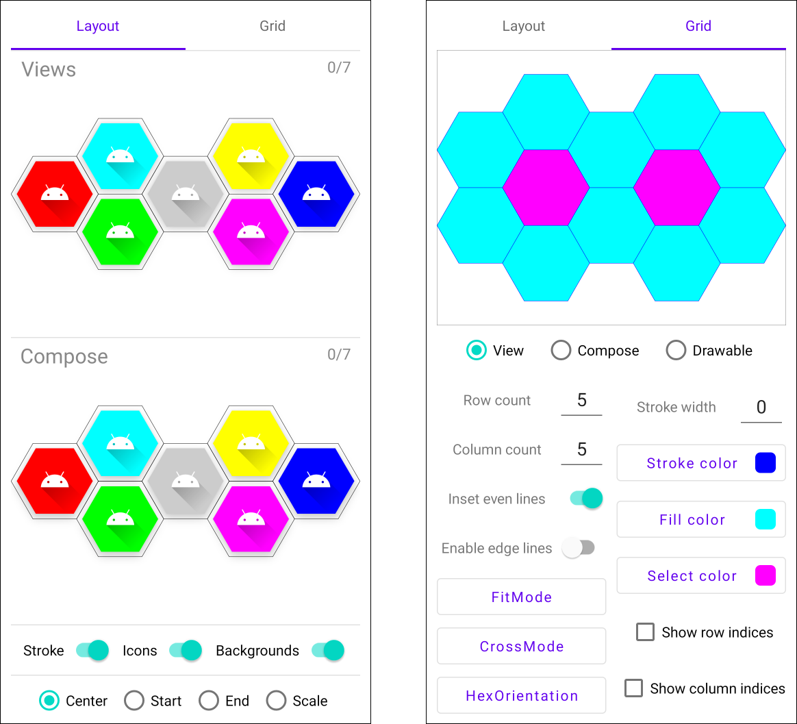
</p>

### Grid's future

I'm not terribly happy with `Grid`'s overall design, as it stands now, but I've
been fiddling with it for too long, so I'm shoving it out the door as is. It may
change significantly in the future, though I really try to not break existing
things when that happens. Just a heads up.

### Touch handling

Currently, when using a grid as a layout, the library does not attempt to alter
the children's actual shapes, nor does it attempt to redirect touch events. If
you have children whose rectangular bounds overlap, and you set your own
touch/click listeners on those children, they are going to behave like in any
other layout: the one on top at the touch point, z-order-wise, wins.

<p align="center">
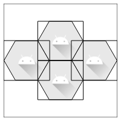
</p>

If you do need your own listeners, it's best to ensure that the
touchable/clickable children lie completely within their cell's bounds.

### Degenerate grid cases

Since the coordinate system here skips every other cross index in a given line,
grids with a row count and/or column count of 1 can behave unexpectedly. I
wouldn't consider these particular setups as "grids", really, but rather than
have weird lower bounds for indices, or specialized behavior for only a handful
of cases, I'll explain what you should expect to see.

#### 1xN and Nx1 grids

Firstly, cells in lines that are in the same direction as the hex's orientation
do not touch each other, so a single line looks like unconnected hexagons, as
shown in the first image here:

<p align="center">
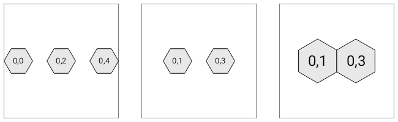
</p>

Additionally, since the zeroth line is even, `insetEvenLines` will visually push
that line away from the component's edge, as you can see in the second image
above. The inset option does affect the other type, too – i.e., where the hex
orientation is perpendicular – like is shown in the last image above.

#### 1x1 grids

A default grid with one row and one column is what you'd think it should be,
like in the first image here:

<p align="center">
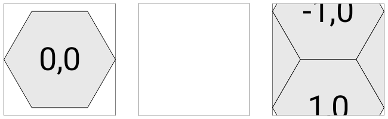
</p>

As previously mentioned, however, `insetEvenLines` changes the valid coordinate
set, so (0,0) doesn't even exist when that option is enabled, and a 1x1 grid
with even lines inset is empty, as is illustrated by the second image above.

The third image shows that second 1x1 grid with `enableEdgeLines` set to `true`.
You can see that (0,0) would be directly in the middle there, and the library
obligingly adds lines on all sides of the empty grid. This setup likely isn't
useful to anyone, but the library doesn't prohibit it.

#### 1x2 and 2x1 grids

Grids with one row or column and two of the other are also peculiar because the
single line in one direction means that the second line in the other doesn't
exist, so they each end up with only one (interior) cell. The examples below all
have 1 row and 2 columns, with the same settings as the 1x1 discussed above.

<p align="center">
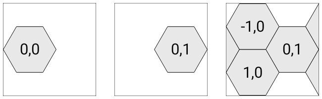
</p>

The first default setup and the second one with even lines inset should both
look as you might have expected from what has been shown so far. The third one
with edge lines enabled might seem incorrect at first, since the previously
missing column appears out of nowhere, but it's not that column that's been
added; rather, it's two new rows, one above and one below.

## Download

I've configured the library to be published, so you can get a compiled version
through [JitPack](https://jitpack.io). The repo's page
is [here](https://jitpack.io/#gonodono/hex-grid), and it has instructions toward
the bottom on how to add JitPack and the library's dependency to your project.

## License

MIT License

Copyright (c) 2024 Mike M.

Permission is hereby granted, free of charge, to any person obtaining a copy
of this software and associated documentation files (the "Software"), to deal
in the Software without restriction, including without limitation the rights
to use, copy, modify, merge, publish, distribute, sublicense, and/or sell
copies of the Software, and to permit persons to whom the Software is
furnished to do so, subject to the following conditions:

The above copyright notice and this permission notice shall be included in all
copies or substantial portions of the Software.

THE SOFTWARE IS PROVIDED "AS IS", WITHOUT WARRANTY OF ANY KIND, EXPRESS OR
IMPLIED, INCLUDING BUT NOT LIMITED TO THE WARRANTIES OF MERCHANTABILITY,
FITNESS FOR A PARTICULAR PURPOSE AND NONINFRINGEMENT. IN NO EVENT SHALL THE
AUTHORS OR COPYRIGHT HOLDERS BE LIABLE FOR ANY CLAIM, DAMAGES OR OTHER
LIABILITY, WHETHER IN AN ACTION OF CONTRACT, TORT OR OTHERWISE, ARISING FROM,
OUT OF OR IN CONNECTION WITH THE SOFTWARE OR THE USE OR OTHER DEALINGS IN THE
SOFTWARE.